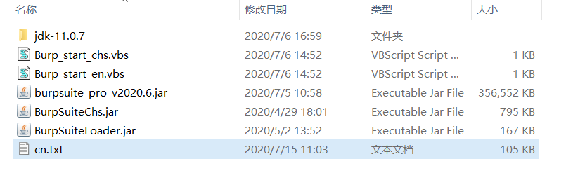

# burp的汉化---个人翻译文本
burp的汉化个人翻译文本
## 使用说明
需要配合burp的汉化插件使用
汉化插件的git地址[BurpSuiteCn](https://github.com/hackxx/BurpSuiteCn "BurpSuiteCn")
插件自己下载哈
将cn.txt文件放在BurpSuiteCn汉化补丁的同级目录即可，汉化补丁会自动读取相关信息
图片预览--大多数都是双语汉化
精力和能力有限、可能有部分汉化错误
且只汉化部分，能满足大多数需求了

